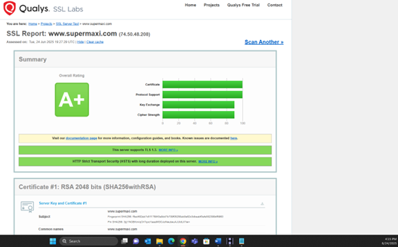
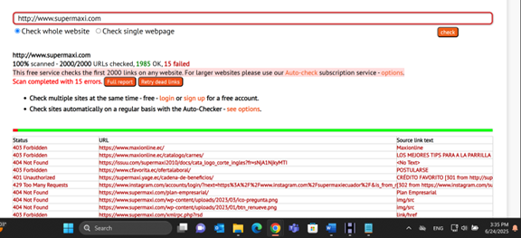
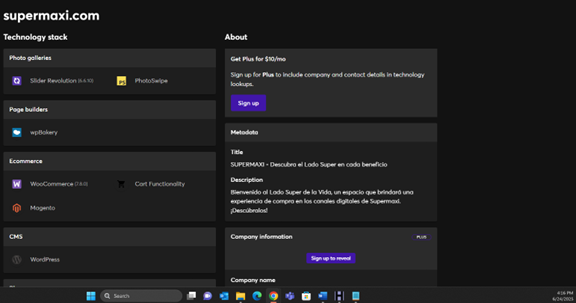

# 🕵️‍♀️ Footprinting – Supermaxi (OSINT Web Recon)

## 🇪🇸 Descripción

Este proyecto documenta un análisis de recopilación de información pública (footprinting) sobre el sitio web de Supermaxi, parte de Corporación Favorita en Ecuador. Se aplicaron técnicas pasivas como inspección de robots.txt, análisis de metadatos, escaneo de enlaces rotos y búsquedas con Google Dorks.

## 🇬🇧 Overview

This project documents a public information gathering (footprinting) analysis on the Supermaxi website, part of Corporación Favorita in Ecuador. Passive techniques were used, including robots.txt inspection, metadata analysis, broken link scanning, and Google Dorks queries.

---

## 🧰 Herramientas / Tools Used

- 🔍 FOCA (metadata extraction)
- 🧲 HTTrack (site mirroring)
- 🕸️ DeadLinkChecker (broken link scan)
- 🔐 SSL Labs (certificate analysis)
- 🧠 Google Dorks (advanced search operators)

---

## 📚 Documentación / Documentation

| Archivo | Descripción | Idioma |
|--------|-------------|--------|
| [`footprinting_ES.md`](./docs/footprinting_ES.md) | Informe técnico completo | Español 🇪🇸 |
| [`footprinting_EN.md`](./docs/footprinting_EN.md) | Full translated report | English 🇬🇧 |
| [`conclusions_ES_EN.md`](./docs/conclusions_ES_EN.md) | Conclusión bilingüe | ES / EN 🇪🇸🇬🇧 |

---

## 🖼️ Evidencias / Evidence

### 🔐 SSL Scan

### 🔗 Enlaces rotos detectados

### ⚙️ Tecnologías detectadas con Wappalyzer

---

## 📎 Referencias

- [Have I Been Pwned](https://haveibeenpwned.com)
- [HTTrack Website Copier](https://www.httrack.com)
- [SSL Labs](https://www.ssllabs.com/ssltest/)
- [UNIR APA 7 Guide](https://bibliografiaycitas.unir.net/#tcontent1_2)
- [Supermaxi Website](https://www.supermaxi.com/)
